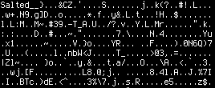
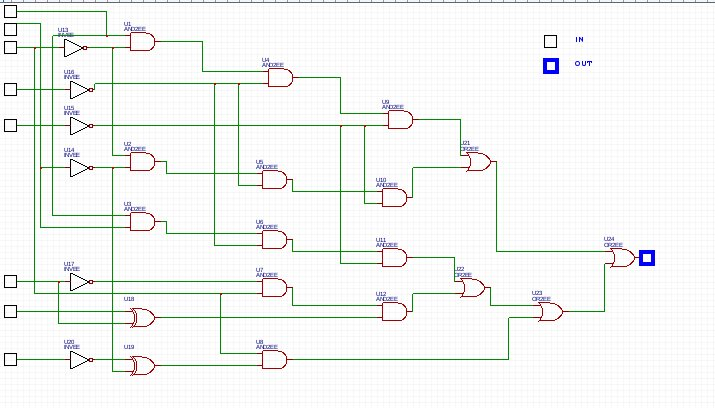
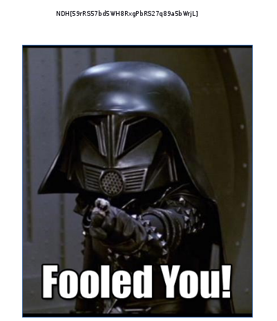

# NDH Quals CTF 2016 : Invest

**Category:** Forensic **Points:** 50 **Solves:** 69

>> Description :
>> A paranoid guy seems to have secured his file very well. But I am convinced he made a mistake somewhere.
>> The challenge is available at : <url>


## Write-up

The given [pcap file](invest.pcapng) contains some internet traffic.
Let's have a quick look :

```python
$ p.sessions
<bound method PacketList.sessions of <invest.pcap: TCP:1275 UDP:194 ICMP:118 Other:57>>
```

```bash
410  54.127033 192.168.0.19 -> 192.168.0.23 HTTP 423 GET /key/key.txt HTTP/1.1 
412  54.127799 192.168.0.23 -> 192.168.0.19 HTTP 509 HTTP/1.1 200 OK  (text/plain)
416  58.750818 192.168.0.19 -> 192.168.0.23 HTTP 412 GET / HTTP/1.1 
417  58.751614 192.168.0.23 -> 192.168.0.19 HTTP 745 HTTP/1.1 200 OK  (text/html)
420  60.049842 192.168.0.19 -> 192.168.0.23 HTTP 414 GET /chall/ HTTP/1.1 
421  60.052882 192.168.0.23 -> 192.168.0.19 HTTP 1253 HTTP/1.1 200 OK  (text/html)
424  61.361098 192.168.0.19 -> 192.168.0.23 HTTP 429 GET /chall/encryptaa HTTP/1.1 
425  61.361617 192.168.0.23 -> 192.168.0.19 HTTP 1626 HTTP/1.1 200 OK 
448  74.648308 192.168.0.19 -> 192.168.0.23 HTTP 377 GET / HTTP/1.1 
450  74.649423 192.168.0.23 -> 192.168.0.19 HTTP 746 HTTP/1.1 200 OK  (text/html)
452  76.378262 192.168.0.19 -> 192.168.0.23 HTTP 414 GET /chall/ HTTP/1.1 
453  76.380374 192.168.0.23 -> 192.168.0.19 HTTP 1253 HTTP/1.1 200 OK  (text/html)
455  76.659970 192.168.0.19 -> 192.168.0.23 HTTP 401 GET /icons/unknown.gif HTTP/1.1 
456  76.660587 192.168.0.23 -> 192.168.0.19 HTTP 594 HTTP/1.1 200 OK  (GIF89a)
490  78.371380 192.168.0.19 -> 192.168.0.23 HTTP 429 GET /chall/encryptab HTTP/1.1 
491  78.371830 192.168.0.23 -> 192.168.0.19 HTTP 1626 HTTP/1.1 200 OK 
618  80.745558 192.168.0.19 -> 192.168.0.23 HTTP 429 GET /chall/encryptac HTTP/1.1 
619  80.745980 192.168.0.23 -> 192.168.0.19 HTTP 1626 HTTP/1.1 200 OK 
```

We can see two files named `key.txt` and `encryptXX`. This looks interesting.
To export them, I simply used Wireshark, and did `Export Objects -> HTTP`.

Now, we have many files :

```bash
$ ls out/
12767348_10208095326368148_1014857467_n.jpeg  encryptad  encryptan  encryptax  encryptbh  encryptbr  encryptcb  encryptcl  encryptcv       image2.gif
%2f                                           encryptae  encryptao  encryptay  encryptbi  encryptbs  encryptcc  encryptcm  encryptcw       key
%2f(1)                                        encryptaf  encryptap  encryptaz  encryptbj  encryptbt  encryptcd  encryptcn  encryptcx       key.txt
back.gif                                      encryptag  encryptaq  encryptba  encryptbk  encryptbu  encryptce  encryptco  encryptcy       poop.jpeg
chall                                         encryptah  encryptar  encryptbb  encryptbl  encryptbv  encryptcf  encryptcp  encryptcz       text.gif
chall(1)                                      encryptai  encryptas  encryptbc  encryptbm  encryptbw  encryptcg  encryptcq  encryptda       unknown(1).gif
chall(2)                                      encryptaj  encryptat  encryptbd  encryptbn  encryptbx  encryptch  encryptcr  encryptdb       unknown.gif
encryptaa                                     encryptak  encryptau  encryptbe  encryptbo  encryptby  encryptci  encryptcs  encryptdc       wp
encryptab                                     encryptal  encryptav  encryptbf  encryptbp  encryptbz  encryptcj  encryptct  hotspot(1).txt
encryptac                                     encryptam  encryptaw  encryptbg  encryptbq  encryptca  encryptck  encryptcu  hotspot.txt
```

As expected, we can see encrypted files, a `key.txt` and pictures.
The files `encryptXX` contains base64-encoded text :

```bash
$ for i in ./encrypt*; do base64 -d  $i >> flag.enc ; done
$ file flag.enc 
flag.enc: data
```

Looking this through `hexedit`, I see :



And `key.txt` contains bits :

```bash
$ cat out/key.txt 
010001110101111001100011011011100100100100111001010111100100011101000111001110010100011100111001010001110011100101000111001110010101111001100011011011100100100101101110010010010011100100110101010111100110001100111001001101010110111001001001011011100100100101000111010111100011100100110101011011100100100101011110011000110100011101011110001110010011010101011110011000110101111001100011010111100110001101000111010111100101111001100011011011100100100101000111010111100011100100110101010001110101111001101110010010010101111001100011010111100110001101101110010010010101111001100011010111100110001100111001001101010100011101011110010111100110001101011110011000110101111001100011010001110101111001000111010111100101111001100011011011100100100101101110010010010101111001100011
```

Once decoded, this gives : `G^cnI9^GG9G9G9G9^cnInI95^c95nInIG^95nI^cG^95^c^c^cG^^cnIG^95G^nI^c^cnI^c^c95G^^c^c^cG^G^^cnInI^c` and it doesn't look like a key/passphrase. 
( I tried, in doubt... #ExpectedFail )
```bash
$ openssl aes-256-cbc -d -in flag.enc > flag ; file flag
enter aes-256-cbc decryption password:
bad decrypt
```

By looking at pictures, I can see an electronic scheme :



Well, there are 8 inputs in the scheme which gives 1 bit as output, and the length of the key is 768.

```bash 
$ len $(cat out/key.txt )
768
```

This means 96 bits, so 12 bytes. Seems legit.
I decided to recode the scheme using BASH :

```bash
a=$1 ; b=$2 ; c=$3 ; d=$4 ; e=$5 ; f=$6 ; g=$7 ; h=$8
i=$(( 1 - $c )) ; j=$(( 1 - $d )) ; k=$(( 1 - $e )) ; l=$(( 1 - $b )) ; m=$(( 1 - $f )) ; n=$(( 1 - $h ))
o=$(( $i & $a )) ; p=$(( $i & $l )) ; q=$(( $a & $b )) ; r=$(( $g ^ $f )) ; s=$(( $n ^ $l ))
t=$(( $o & $j )) ; u=$(( $p & $j )) ; v=$(( $j & $q )) ; w=$(( $m & $c )) ; x=$(( $s & $c ))
y=$(( $t & $k )) ; z=$(( $k & $u )) ; A=$(( $v & $k )) ; B=$(( $w & $r ))
C=$(( $y | $z )) ; D=$(( $A | $B ))
E=$(( $D | $x )) ; F=$(( $C | $E ))
echo $F
```

Let's try this :

```bash
$ while read l; do bash scheme.sh $l ; done < <(grep -oPe '.{8}' out/key.txt  | sed -re 's/./&/g') | tr -d '\n'
001101000101010101101011011110100011100100110101010001100011001001011001011100010101000001101001

$ len $(while read l; do bash scheme.sh $l ; done < <(grep -oPe '.{8}' out/key.txt  | sed -re 's/./& /g') | tr -d '\n')
96
```

It seems to work, let's translate it into ASCII :

```bash 
$ python -c 'from Crypto.Util import number;print(number.long_to_bytes(int("'$(while read l; do
> bash scheme.sh $l
done < <(grep -oPe '.{8}' out/key.txt  | sed -re 's/./& /g') | tr -d '\n')'", 2)))'
4Ukz95F2YqPi
```

WOW, looks like a legit passphrase.

Decrypt the file with this key :

```bash
$ openssl aes-256-cbc -d -in out/flag.enc > flag ; file flag
enter aes-256-cbc decryption password:
flag: Microsoft Word 2007+
```

Open this Word document, and see the flag behind the picture.



<br>
Pwned. <br>
__Flag__ : NDH[59rRS57bd5WH8RxgPbRS27q89a5bWrjL]

Enjoy,<br>
\- [Notfound](http://www.notfound.ovh)
